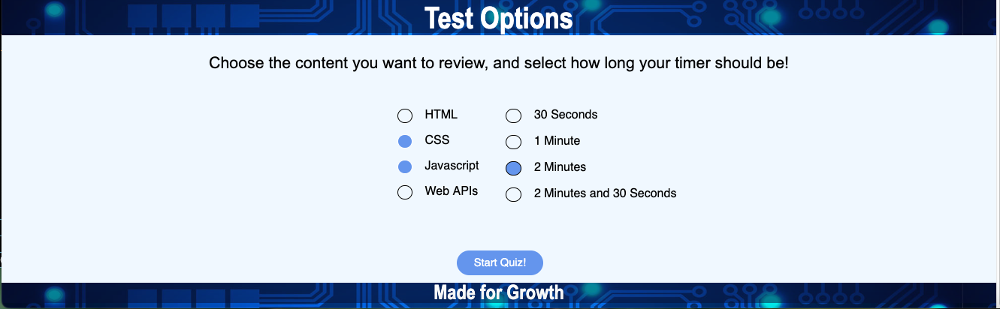
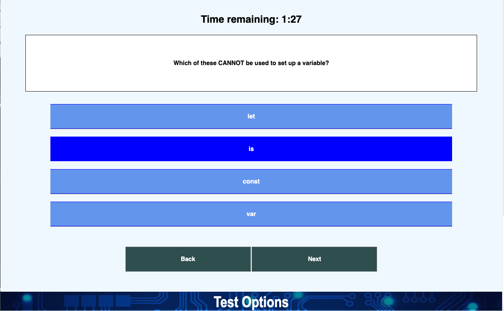
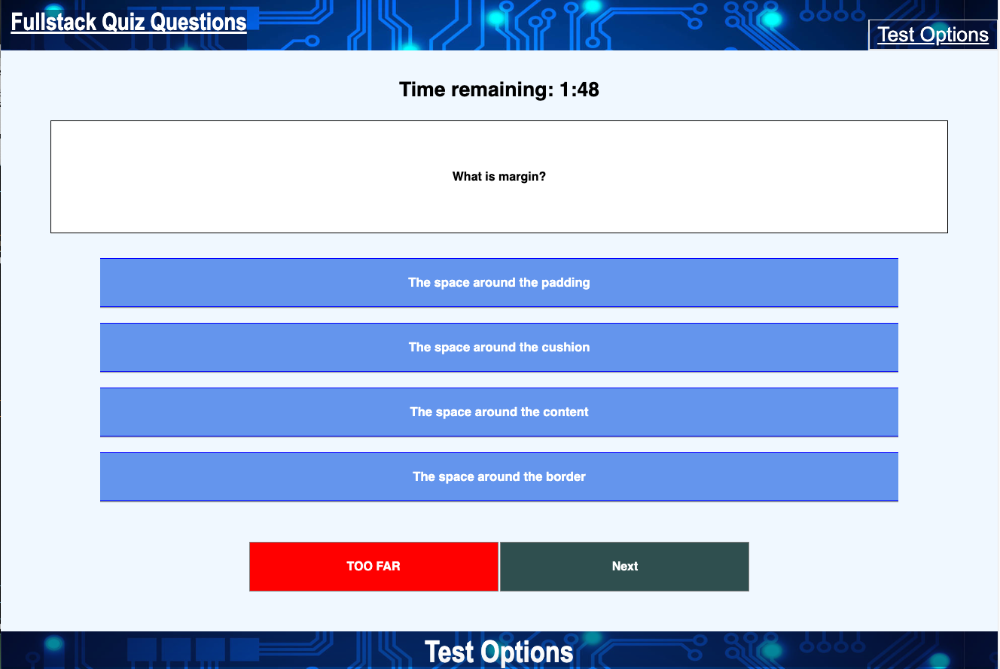
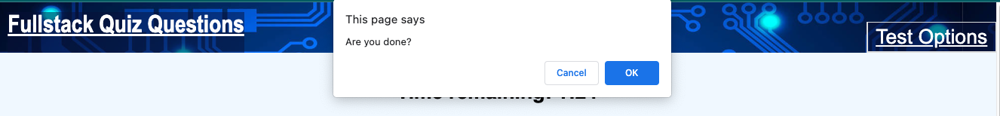
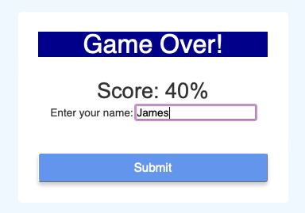
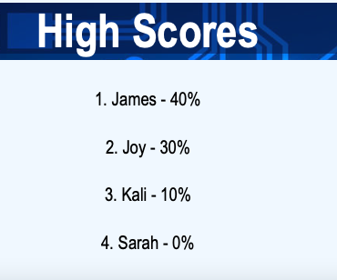

# Fullstack Quiz

## Description

This project is designed to help individuals currently studying computer science to practice common interview questions or concepts in different computer languages. This also comes with a timer that helps
users to think quickly and identify the correct solutions as soon as possible. 

## Usage

Users can click Test Options at the top of the screen or scroll down to it and select one or more languages
and a time limit and start the game. After that users choose the option that best answers the question
and hit the next button after each chice. If a user wants to go back they can select the back button as well.
At the final question the game will confirm the user is done answering and then score them, or if the user
runs out of time then the game will remove the quiz and show the final score.

Users can select up to four languages and one timer for each game.

The current choice the user has selected will be highlighted before they proceed to the next question

When users try to go back to a question before the very first question, the game lets them know
that no such question exists.

Users will get a chance to confirm they are happy with their choices before finishing the game.

When a user either finishes the game or runs out of time the score will be shown after clearing all the questions
and ask for the users name.

where the names of players go after the game

## License

N/A

# References/Credits

make boxes transparent:
https://developer.mozilla.org/en-US/docs/Learn/CSS/Howto/Make_box_transparent#

border for nav
https://www.w3schools.com/css/tryit.asp?filename=trycss_list-style-border

using before in css:
https://developer.mozilla.org/en-US/docs/Web/CSS/::before#

fixing checkboxes breaking line:
https://www.thesitewizard.com/css/prevent-word-wrapping.shtml#:~:text=How%20to%20Prevent%20Word%20Wrap,instead%20of%20a%20normal%20space.

checkbox styling:
https://alvarotrigo.com/blog/css-checkbox-styles/

grouping buttons together:
https://www.w3schools.com/howto/howto_css_button_group_vertical.asp
https://forum.freecodecamp.org/t/solved-couldnt-center-btn-group-in-bootstrap4/160466/10

centering inline element
https://teamtreehouse.com/community/how-to-center-inlineblock-button-in-css

https://www.w3schools.com/howto/howto_js_remove_class.asp

timer:
https://www.youtube.com/watch?v=x7WJEmxNlEs

https://codepen.io/ideaguy1974/pen/pZBBLK

Local Storage:
https://developer.mozilla.org/en-US/docs/Web/API/Document/DOMContentLoaded_event

https://www.w3schools.com/js/js_json_parse.asp

https://developer.mozilla.org/en-US/docs/Web/API/Event/preventDefault

https://www.w3schools.com/java/ref_string_trim.asp

other:

https://www.w3schools.com/jsref/jsref_switch.asp#:~:text=The%20switch%20statement%20executes%20a,of%20code%20to%20be%20executed.

https://www.w3schools.com/tags/att_input_type_radio.asp

https://css-tricks.com/almanac/properties/w/whitespace/#:~:text=If%20you%20want%20to%20prevent,line%20(in%20the%20code).

https://www.w3schools.com/howto/howto_js_scroll_to_top.asp

https://www.geeksforgeeks.org/html-dom-input-checkbox-checked-property/

https://www.youtube.com/watch?v=AF6vGYIyV8M

https://michael-karen.medium.com/how-to-save-high-scores-in-local-storage-7860baca9d68